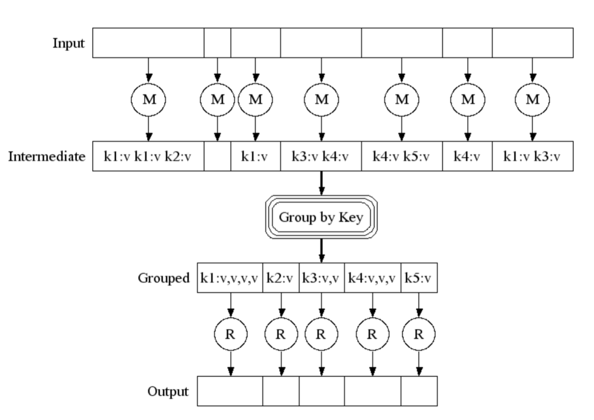

MapReduce
==========

## Introduction

* Based on concepts of Functional programming
* Enables parellelisation and fault tolerence of data processing
* User specifies a `map` function and a `reduce` function
* Map function takes a key-value pair and produces a list of intermediate key-value pairs
    - The type of intermediate key-value pairs differs from that of the input key-value pair
    - map function
    ```
    (k1, v1) --map--> list(k2, v2)
    ```
* Reduce function takes an intermediate key and a list of associated values with that intermediate key as input and produces a (smaller, usually 0 or 1 values) list of values as output
    - The type of intermediate key-value pairs and the output key-value pair is the same
    - reduce function
    ```
    (k2, list(v2)) --reduce--> list(v2)
    ```



## Frameworks and Tools

* Apache Hadoop
    - Components
        + MapReduce or other workloads
        + YARN for cluster resource management
            * Runs your code on multiple nodes
        + HDFS
    - MapReduce
        + Mapper
        + Combiner
        + Reducer


## References
[Google Paper - MapReduce](http://static.googleusercontent.com/media/research.google.com/en//archive/mapreduce-osdi04.pdf)
