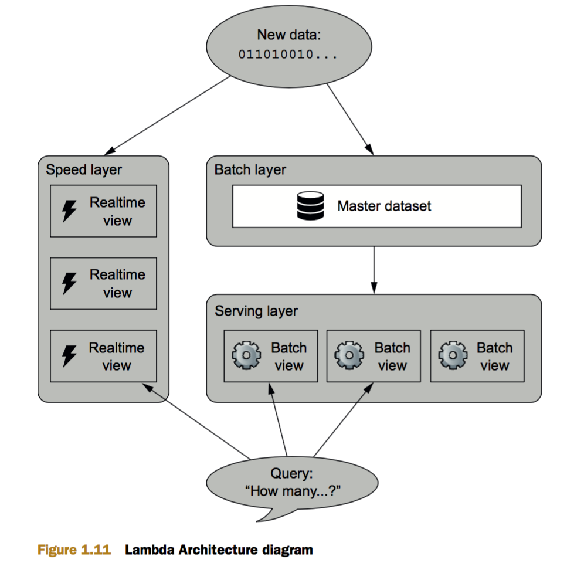

Big Data - Principles and best practices of scalable real-time data systems
===========================================================================

## A new paradigm for Big Data
* Lambda architecture - alternate approach to traditional RDBMS to handle big data systems
* Traditional approaches to scalability
    - Add a queue and worker process between app and DB to enable batched writes to DB
    - Horizontal partitioning or sharding
        + Resharding problem
        + Fault tolerance issues
        + Corruption issues due to bugs
    - Why is it problematic?
        + DB system not self aware of the distributed nature; sharding, replication, distributed queues - all responsibility pushed to ops and application code
        + Human failure tolerance is not optional, especially as big data adds to the complexities of applications
* Recent Big Data systems 
    - are aware of their distributed nature; concepts of sharding and replication are internalized to the DB system.
    - immutable data set result in greater human fault tolerance
* First principles
    - Data System: answers questions based on information that was acquired in the past up to the present
    - Data: the rawest information that is not derived from anything
    - Information: derived from data. Ex: bank balance is derived from credit and debit transaction data
    - query = function(all data)
    - Lambda architecture provides a general purpose approach to implementing an arbitrary function on an arbitrary dataset and having the function return its results with low latency
* Desired properties of a Big Data system
    - Robustness and fault tolerance (including human fault tolerance)
    - Low latency reads and updates (without compromising the robustness of the system)
    - Scalability
    - Generalization; to suit all applications / use-cases
    - Extensibility
    - Ad-hoc queries
    - Minimal maintenance
    - Debuggability
* Lambda Architecture
    - Layered architecture
        + Speed layer
        + Serving layer
        + Batch layer
    - Batch views
        + Expensive and wasteful to read all data to answer each query
        ```
        batch views = function (all data) // batch views are pre-computed
        query = function (batch view)
        ```
        + Computed by batch layer of lambda architecture
    - Batch layer
        + stores master dataset - immutable, constantly growing
        + computes arbitrary views
        + Best done using batch-processing systems like Hadoop
        + Batch processing is easy to scale horizontally
        + Batch computation has high parallelism
    - Serving layer
        + Specialised distributed databases that store batch views computed by the batch layer
        + Allow random queries to be executed on batch views
        + Serving layer DB 
            * supports batch updates and random reads
            * Don't need to support random writes which cause most of the complexity in databases
            * Example: Elephant DB, Cassandra
    - Batch and Serving layers together
        + Support almost all properties desired of big data systems except for low latency updates
    - Speed layer
        + Compensate for high latency updates to serving layer
        + Fast, incremental algorithms
        + Realtime views
        ```
        relatime view = function(realtime view, new data)
        ```
        + Overall architecture of all 3 layers combined
        ```
        batch view = function(all data)
        realtime view = function(realtime view, new data)
        query = function(batch view, realtime view)
        ```
    - Lambda Architecture
    
        + Complexity isolation - the speed layer is required to handle a small data set and as data makes its way to serving layer, it is no longer needed in the speed layer
        + Some algorithms are difficult to compute incrementally
            * Batch layer uses exact algorithms, while speed layer uses approximations
            * Batch layer repeatedly overrides the speed layer and the approximations _eventually_ get corrected
